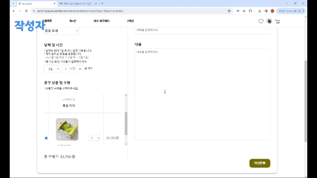
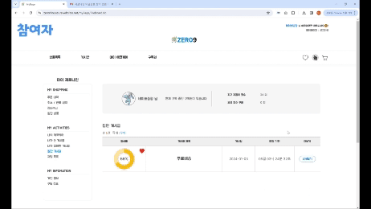
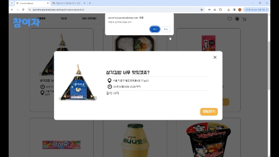
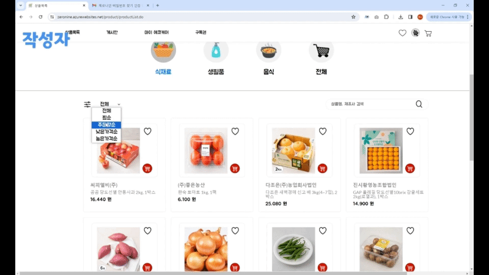
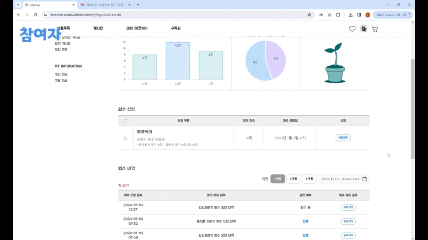
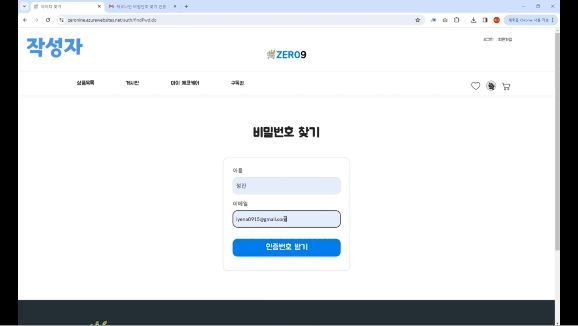
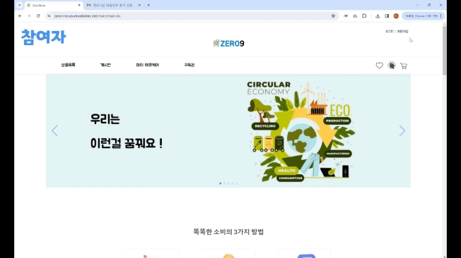

# Project Zeronine

# 목차
- [project_zeronine](#project_zeronine)
- [목차](#목차)
- [팀원 소개](#기여자)
- [프로젝트 소개](#프로젝트-소개)
- [주요 서비스](#주요-서비스)
- [기술 스택](#기술-스택)
- [데모](#Demo) 
- [데모 영상 링크](#Demo-Video)

## 팀원 소개
|**노승광**|**방용수**|**유은경**|**이예나**|**정주영**|
|:---:|:---:|:---:|:---:|:---:|
|[github](https://github.com/seung-gwang)|[github](https://github.com/BangYongSu)|[github](https://github.com/yueunkyung)|[github](https://github.com/aeyena)|[github](https://github.com/cjy1947)|

## 프로젝트 소개
프로젝트 진행 기간: 2023.11 - 2024.01

제로나인 프로젝트는 1인 가구 소비자들에게 낭비 없는 소비 경험과 간편한 폐기물 처리 서비스를 제공합니다. 

낭비 없는 소비를 위해 다양한 유형의 공동 구매 서비스를 제공합니다.

간편한 분리 배출을 위한 분리 배출 예약 서비스를 제공합니다.

## 주요 서비스

1. **묶음 상품 분할 공동 구매(즉시 배송)**
   - 묶음 상품에 대해 소비자가 모여 나눠서 구매하는 공동 구매 서비스 입니다. 묶음 상품 중 일부만 필요한 소비자가 유용하게 사용할 수 있습니다.

2. **무료 배송 최소 금액 함께 채우기 공동 구매(무료 배송)**
   - 무료 배송을 받기 위해 최소 금액에 도달하지 못한 소비자들이 함께 상품을 구매하여 최소 금액을 채우고, 무료 배송 혜택을 받는 서비스입니다.

3. **채팅 직거래 서비스(1:1 직거래)**
   - 소비자들 간에 채팅을 통해 상품을 직거래하는 서비스로, 1:1 직거래 방식을 제공합니다.

4. **분리 배출 서비스(에코케어)**
   - 환경 보호를 위해 폐기물을 효율적으로 처리하는 서비스인 에코케어를 제공합니다. 간편한 수거 예약을 통해 서비스를 이용할 수 있습니다.

## 기술 스택

 
  <h2>Front End</h2>
   
   
   
  
   
<h2>Back End</h2>
   
   
  <h2>Environment</h2>
   
   
  
  
   
  <h2>Collaboration Tool</h2>
  
  
   

## Demo
|       **게시글 작성하기**        |
| :---------------------------------------------------------------------------------------------------------------------: |
|  |
|즉시배송, 무료배송, 1:1 거래 공동구매를 위하여 글을 작성할 수 있습니다.  포트원 API를 사용하여 결제를 구현했습니다|

|       **게시글 참여하기**        |
| :---------------------------------------------------------------------------------------------------------------------: |
|  |
|작성된 즉시배송, 무료배송 거래 게시글에 참여할 수 있습니다|

|       **1:1 거래 채팅하기**        |
| :---------------------------------------------------------------------------------------------------------------------: |
|  |
|1:1 거래를 위해 채팅을 할 수 있습니다|

|       **상품 목록**        |
| :---------------------------------------------------------------------------------------------------------------------: |
|  |
|간편한 상품 조회를 위해 페이징, 정렬, 필터링, 검색 기능을 제공합니다|

|       **소셜 로그인**        |
| :---------------------------------------------------------------------------------------------------------------------: |
|  |
|에코케어-폐기물 수거를 신청하고 관련 통계를 확인할 수 있습니다|

|       **비밀 번호 찾기**        |
| :---------------------------------------------------------------------------------------------------------------------: |
|  |
|Mail Sender를 이용하여 이메일로 비밀번호를 찾을 수 있도록 구현했습니다|

|       **소셜 로그인**        |
| :---------------------------------------------------------------------------------------------------------------------: |
|  |
|네이버 소셜 로그인 API를 활용하여 간편하게 로그인 할 수 있습니다|

##  Demo Video
서비스 이해를 돕기 위한 동영상입니다. 아래 유튜브 링크에서 감상해주세요
[Youtube Video](https://youtu.be/pcg0NWE-zow)
